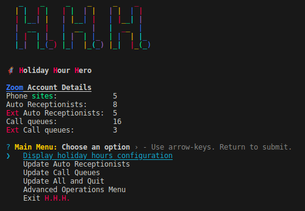

# Holiday Hour Hero (H.H.H.)

> **Note**
>
> The following sample application is a personal, open-source project shared by the app creator and not an officially supported Zoom Video Communications, Inc. sample application. Zoom Video Communications, Inc., its employees and affiliates are not responsible for the use and maintenance of this application. Please use this sample application for inspiration, exploration and experimentation at your own risk and enjoyment. You may reach out to the app creator and broader Zoom Developer community on https://devforum.zoom.us/ for technical discussion and assistance, but understand there is no service level agreement support for this application. Thank you and happy coding!

Holiday Hour Hero



This is a simple nodejs application that makes bulk administration of holiday hours easier.

**Features:**
- Use JSON to configure holiday hours
- Bulk update Auto Receptionists and Call Queues
- Bulk removal of holiday hours
- Testing mode (only the first record is modified)

**Getting Started:**
1. Install docker and make sure it is running https://docs.docker.com/engine/install/
2. Modify the .env file with your zoom S2S credentials
    - Scopes required:
        - phone:read:admin
        - phone:write:admin
3. Edit ```hours.json``` with your holiday hours
4. Run ```docker compose run --rm --build hhh```
5. Enjoy!

> To disable test mode, remove the ```TESTING=true``` line from the .env file.

[Click here to watch a video tutorial on getting started](https://www.youtube.com/watch?v=81a6Qp2byAA)
